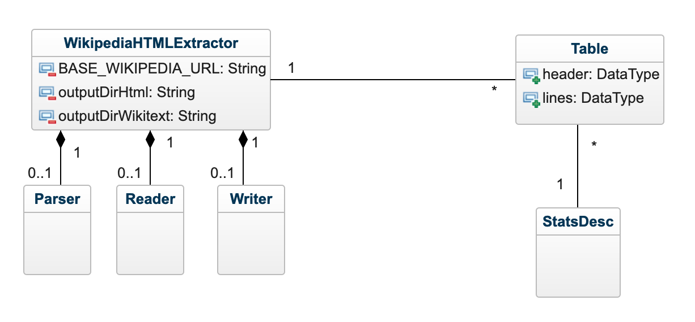

# Projet Wikipedia Matrix

## Objectif 

Ce programme a pour objectif d'extraire des tableaux issus de page wikipedia. A partir du code HTML des pages wikipdia, on extrait les tableaux pour les sauvegarder au format CSV.

A partir de 300 URLs wikipedia, le challenge est d'extraire le maximum de tableau pertinents.


## License

Ce projet est disponible sous license [MIT](https://choosealicense.com/licenses/mit/)


## Instalation : 

Une fois le projet cloné vous pouvez lancer les tests/benchmark :
```
cd wikimatrix 
mvn test
``` 

## Architecture


